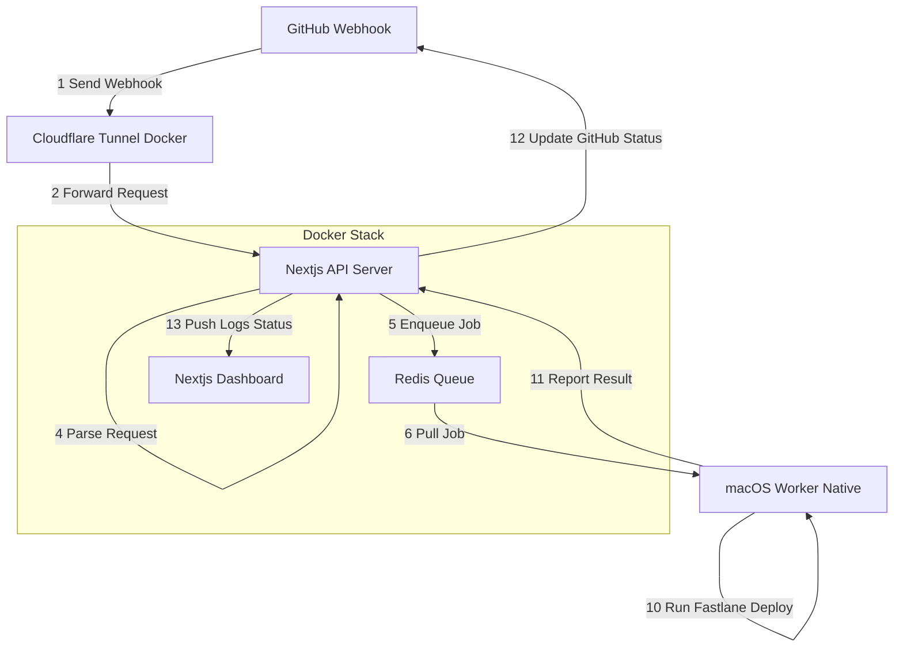

고비용의 GitHub Actions와 EC2 macOS 인스턴스를 계속 사용하기보다, **집에 있는 Mac mini를 활용해 안전하고 자동화된 배포 서버를 구축하는 것**이 목표다. 이 시스템은 깃허브 이벤트(특히 태그 생성)를 기반으로 배포 작업을 트리거하며, 여러 레포에서 들어오는 배포 요청을 **순차적 Queue 방식으로 처리**하고, 인증된 레포만 접근하도록 설계된다.

---

# 왜 Mac mini 기반 Self‑Hosted 배포인가?

GitHub Actions 또는 EC2 Mac 인스턴스를 통해 iOS 빌드를 수행하면 **배포 1회당 비용이 매우 높다**. 실제로 하루 20회, 1회 20분 기준으로 계산해 보면 다음과 같다:

| 환경                 | 비용      | 1일 비용   | 1개월 비용   |
| ------------------ | ------- | ------- | -------- |
| GitHub Actions     | $0.08/분 | 47,040원 | 약 141만 원 |
| EC2 macOS instance | $26/일   | 26달러    | 약 115만 원 |

즉, **한 달만 지나도 Mac mini 한 대값이 나오므로**, 남아 있는 Mac mini를 활용하는 것이 훨씬 효율적이다.

또한, 개인 노트북을 빌드 머신으로 쓰면 환경 변수가 남고 보안 위험이 있어 별도 기기를 운용하는 것이 더 안전하다.

---

# 구축 목표 (Requirements)

- 직접 포트를 개방하거나 SSH 노출 없이 **인증된 깃허브 레포에서만 배포 요청 가능**해야 함
- 배포 요청 발생 시 레포를 clone하여 내부적으로 **Fastlane**으로 빌드 및 배포
- 레포별 **환경 변수를 안전하게 불러와** 빌드 시 활용해야 함
- 여러 레포에서 동시에 요청해도 **순차적으로 작업을 처리**해야 함
- 빌드 현황을 확인할 수 있는 **대시보드(UI)** 제공

---

# 기술 스택 구성

## 1) GitHub Apps

- 배포 허용 레포를 관리
- 태그 생성 등 특정 이벤트가 발생하면 webhook으로 Mac mini 서버에 전달
- 인증되지 않은 레포는 접근 불가 → 보안적 이점

## 2) Cloudflare Tunnel

- Mac mini의 포트를 직접 노출하지 않고도 외부에서 Webhook 요청을 받을 수 있는 안전한 터널
- 방화벽 설정 없이도 인증된 URL을 생성할 수 있음

## 3) Redis Queue

- 여러 레포가 동시에 배포 요청해도 순차적 실행을 위한 Queue 시스템
- 태그 생성 → Queue push → Worker가 하나씩 처리하는 구조

## 4) Fastlane Match + AWS S3

- iOS 배포에 필요한 인증서/프로비저닝 관리를 자동화
- AWS S3에 암호화 저장하여 여러 배포 환경에서도 안전하게 동작

## 5) AWS Secrets Manager

- 레포별 환경 변수 및 비밀 키 저장소
- 배포 Worker가 필요한 시점에만 안전하게 secrets 로드

---

# 최종적으로 구축되는 배포 환경

- **GitHub Apps** → 인증된 레포에서 태그 생성 시 Webhook 전송
- **Cloudflare Tunnel** → 외부 요청을 안전하게 Mac mini로 전달
- **Next.js API + Redis Queue** → 배포 요청을 안전하게 저장 및 순차적 처리
- **macOS Worker** → 레포 clone → 환경 변수 로드 → Fastlane 실행 → 배포
- **Dashboard(UI)** → 배포 현황/로그 확인 가능

이 전체 구성으로 EC2나 GitHub Actions 비용 없이 안정적이고 자동화된 배포 환경을 구축할 수 있다.****

## 배포 다이어그램

