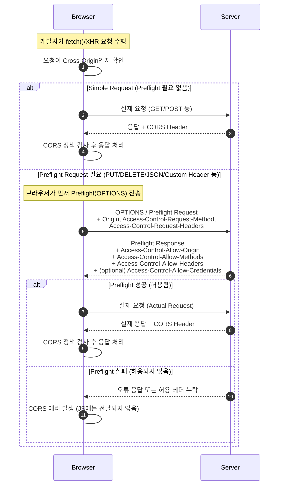

# 웹의 기본 원리 이해

## HTTP 동작 원리
HTTP는 Hyper Text Transfer Protocol로, 웹 리소스를 요청/응답하기 위한 프로토콜입니다.

### HTTP 특징

| 특징                   | 설명                                                                    |
| -------------------- | --------------------------------------------------------------------- |
| 클라이언트-서버 구조          | 서버가 먼저 메시지를 시작하지 않음.                                                  |
| Stateless            | 서버는 각 요청 간 사용자의 상태를 기억하지 않는다.                                         |
| Request - Response기반 | HTTP는 반드시 클라이언트가 요청을 시작해야 함.                                          |
| Connectionless       | HTTP 1.0은 **요청 → 응답 → 연결 종료** 형태였으나 http 1.1의 keep-alive 속성으로 의미가 약해짐 |
| 텍스트 기반 프로토콜          | 요청과 응답이 사람이 읽을 수 있는 텍스트 문자열로 이루어짐.                                    |


> keep-alive: 한 번 생성한 TCP 연결을 여러 HTTP 요청/응답에 재사용하도록 하는 메커니즘이다.
#### 어떻게 keep-alive가 TCP handshake를 하지않고 바로 연결할까?
한 번 handshake로 만들어진 TCP 연결을 끊지 않고 재사용하기 때문에 이후 요청에서 handshake 과정이 생략되는 것입니다

연결에 대한 관리는 OS(커널)레벨에서 관리합니다

#### Q. 커널에서 어떻게 관리하나요?


## 쿠키 / 세션 / JWT 구조

### 쿠키란?
쿠키(Cookie)는 웹 서버가 클라이언트(브라우저)에 저장하는 작은 데이터로,
HTTP가 Stateless이기 때문에 발생하는 ‘상태 유지 문제’를 해결하기 위해 사용됩니다.
브라우저는 저장된 쿠키를 동일한 도메인으로 요청할 때 자동으로 전송하여
서버가 사용자를 식별하거나, 로그인 상태 유지, 설정 저장 등을 할 수 있게 합니다.

### 쿠키의 구성요소


```
Set-Cookie: sessionId=abc123; Path=/; Expires=Wed, 21 Oct 2025; 
            HttpOnly; Secure; SameSite=Lax
```

| 이름                | 설명                                   |
| ----------------- | ------------------------------------ |
| name=value        | 쿠키의 실제 데이터                           |
| Path              | 어떤 경로에서 쿠키를 포함할지 결정                  |
| Domain            | 어떤 도메인에서 쿠키를 전송할지 결정                 |
| Expires / Max-Age | 쿠키 만료 시점 (Max-Age: 초단위)              |
| HttpOnly          | JavaScript에서 document.cookie로 접근 불가능 |
| Secure            | HTTPS 요청시에만 전송                       |
| SameSite          | CSRF 방어                              |
브라우저 내부에 쿠키가 저장됩니다

### 쿠키종류

| 이름                | 설명                               |
| ----------------- | -------------------------------- |
| session cookie    | 브라우저 세션동안 유지되는 쿠키                |
| persistent cookie | Expires 또는 Max-Age가 있으며 재시작해도 유지 |
| Secure Cookie     | HTTPS에서만 전송됩니다                   |
| HttpOnly          | JS에서 접근이 불가능한 쿠키입니다              |


### Q. 어떻게 HttpOnly를 설정하면 JS에서 접근이 안될까?

### Q. 세션쿠키가 어떻게 브라우저세션에서만 유지가될까?

### Q. SameSite Lax, Strict, None의 차이점이 무엇인가?


## REST / RESTful API

REST(Representational State Transfer)는 웹 리소스를 “자원(Resource)”으로 보고,
HTTP 메서드(GET/POST/PUT/DELETE 등)와 URI를 통해 자원을 표현하고 조작하는 아키텍처 스타일입니다.
RESTful API란 이 REST 원칙들을 잘 지켜서 설계한 API를 말하며,
리소스 중심의 URI, 표준 HTTP 메서드 사용, Stateless, 캐싱 가능 등의 특징을 가집니다.

### REST 제약조건

#### Client-Server
클라이언트와 서버의 역할을 분리한다.
서로 독립되어 서버를 바꿔도 클라이언트가 영향을 받지않고, 반대도 마찬가지로 영향을 받지 않도록 한다

#### Stateless
서버는 각 요청을 독립적으로 처리한다
이전 요청 정보를 서버에 보관하지 않으므로 서버의 상태관리 비용이 없다.
클라이언트는 필요한 정보(토큰)을 포함해서 보내도록 하여 요청이 하나의 단위로 완결될수 있도록 한다

#### Cacheable
서버 응답에 이 응답을 캐시해도 되는지/안되는지 를 명시한다
캐시 가능한 응답은 클라이언트나 중간 Proxy가 재사용 가능하다. 트래픽 절감, 응답속도 향상, 서버 부하를 감소시킨다.

#### Uniform Interface
인터페이스의 일관성으로 클라이언트/서버 API가 명확하고 예측 가능
- Resource Identifier - URI로 리소스 식별
- Manipulation Through Representations - JSON, XML 등 표현을 통해 자원 조작
- Self-Descriptive Message 메시지 자체에 데이터 + 처리방식 정보를 포함 (Content-Type)
- Hypermedia as the Engine of Application State (HATEOAS) 응답안에 다음 가능한 행동 링크 포함

#### Layered System 계층화 시스템
클라이언트는 일반적으로 최종 서버에 직접 연결되어 있는지, 아니면 중간 중개 서버에 연결되어 있는지 알 수 없습니다. 중개 서버는 부하 분산을 활성화하고 공유 캐시를 제공하여 시스템 확장성을 향상시킬 수 있습니다. 계층은 보안 정책을 시행할 수도 있습니다.


#### Code On Demand (선택사항)
서버가 클라이언트에게 실행 가능한 코드를 보내서 기능을 동적으로 확장 가능
- 예: 서버가 JavaScript를 내려 클라이언트 기능 보강


### Q. Code On Demand를 보고 생각난건데, 최근에는 js 번들을 분리해서 내려주는 최적화 기법이 있다. 이부분도 Code On Demand로 볼수있는걸까?

### Q. Cache-Control, Etag 등 캐시 메커니즘의 종류

### Q. 캐시 매커니즘의 동작원리


## URL/URI/URN 개념 구분
URI는 리소스를 식별하는 모든 식별자를 말하고,
URL은 리소스의 ‘위치(주소)’를 나타내는 URI의 한 종류이며,
URN은 리소스의 ‘이름’을 나타내는 URI의 한 종류입니다.
즉, URI = URL + URN(을 포함한 상위 개념)입니다.

### URL(Uniform Resource Locator)
URL은 반드시 리소스의 접근 방법(프로토콜) + 위치(호스트/경로)를 포함해야 한다.
```
https://example.com/users/10
ftp://myserver.com/file.txt
```

### URN
어디에 있는지 몰라도, **그 리소스를 유일하게 식별할 수 있는 이름**을 의미한다.
```
urn:isbn:0451450523
urn:uuid:6e8f9a8e-1234-4e9a-bb23-b6e70de5c123
```
책 ISBN번호나 고유 UUID 값 같은 위치가 변해도 이름은 변하지 않는 식별 방식이다.

### Q. AWS의 URI, URN


---

# 보안 기초
## origin의 구성요소
프로토콜(http/https) + 도메인 + 포트
프로토콜, 도메인, 포트가 다른경우 같은 origin으로 평가하지 않습니다


## SOP(Same Origin Policy)
브라우저가 서로 다른 출처(origin)간의 중요한 리소스 (쿠키, DOM, LocalStorage등) 을 공유하지 못하게 막는 보안정책 입니다

이 정책으로 인해 악성사이트가 다른 도메인의 쿠키값에 접근하거나, LocalStroage를 접근하는것을 막을수 있습니다.

## CORS(Cross Origin Resource Sharing)
서로 다른 출처간 요청이 필요한경우 특정 Origin을 허용하도록 명시해 SOP를 부분적으로 완화하는 메커니즘입니다.

### CORS 동작구조

1. 클라이언트에서 요청을 보낼때 브라우저가 SOP를 체크합니다
2. SOP위반 가능성이 있으면 Preflight Request(OPTIONS)를 전송합니다
3. 서버가 다음 헤더를 포함해 응답합니다
	1. Access-Control-Allow-Origin: https://client.com
	2. Access-Control-Allow-Credential: true
	3. Access-Control-Allow-Methods: GET, POST, PUT, DELETE
	4. Access-Control-Allow-Headers: Content-Type, Authorization
4. 클라이언트가 허용되는 origin인경우 요청을 마저 보냅니다
5. 실패하는경우 CORS 오류로 요청을 차단합니다.

simple request의 경우 preflight request를 보내지않고 바로 요청을 보냅니다.
응답이 CORS를 허용하지 않는 헤더라면 JS에 전달하지않고 CORS 오류로 브라우저를 차단합니다

### Access Control Allow 헤더

| 이름          | 설명                                                                |
| ----------- | ----------------------------------------------------------------- |
| Origin      | 어떤 origin을 허용할지                                                   |
| Credentials | 쿠키를 포함한 인증정보를 허용할지                                                |
| Methods     | 허용할 HTTP 메서드                                                      |
| Headers     | 허용할 헤더                                                            |
| Max-Age     | Preflight를 캐싱하는 시간(초)입니다. 이 시간동안은 같은요청에 대해 Preflght를 다시 보내지 않습니다. |

### Preflight Request
Preflight Request는 브라우저가 Cross-Origin 요청을 보내기 전에,
서버가 해당 요청을 허용하는지 확인하기 위해 먼저 보내는 “사전 검증 요청(OPTIONS)“이다.
브라우저는 서버가 올바른 CORS 허용 헤더를 응답하면 그때서야 실제 요청을 전송한다

### SImple Request와 Preflight Request
| **구분**           | **Simple Request**                                     | **Preflight Request** |
| ---------------- | ------------------------------------------------------ | --------------------- |
| OPTIONS 요청 발생 여부 | ❌ 없음                                                   | ✔ 있음                  |
| 브라우저가 위험하다고 판단?  | 아니오                                                    | 예                     |
| Method           | GET, POST, HEAD                                        | PUT, DELETE, PATCH 등  |
| Content-Type     | x-www-form-urlencoded, text/plain, multipart/form-data | application/json 등    |
| Custom Header 사용 | ❌ 불가                                                   | ✔ 가능                  |
| 속도               | 빠름                                                     | OPTIONS 한 번 더 필요 → 느림 |
| 서버 요구사항          | Allow-Origin만 있으면 됨                                    | Allow-* 헤더 다 필요함      |


### CORS 동작구조 mermaid




## XSS

## CSRF

## SQL Injection

## HTTPS와 암호화 기본


---

# 서버 아키텍처 이해

## 프록시 / 포워드 프록시 / 리버스 프록시

## CDN / 로드 밸런싱

## 웹 캐시 전략


---


# 인증/인가

## JWT + Refresh Token 전략
## 세션 기반 인증과 비교

## Access Token 로테이션

## Token 탈취 시 대응 전략(Blacklist vs Short-lived token)


---

# 5단계: 네트워크 타임아웃

## Connection Timeout

## Read Timeout 

## Retry 전략

## 장애 대응 패턴(Circuit Breaker 등) 


---

# **📘** 

# 실제 적용

## Reverse Proxy(Nginx) 세팅

## XSS/CSRF/SQl Injection 방어 실제 적용 

## 캐시 정책(Cache-Control, ETag) 실험 


# 참고
> https://www.restapitutorial.com/introduction/restconstraints