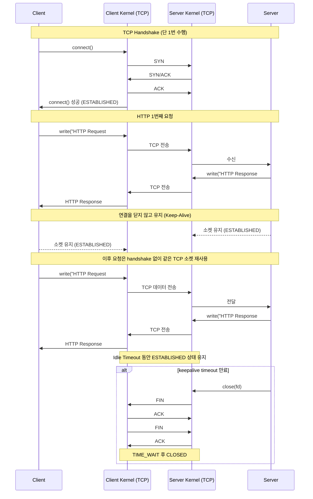
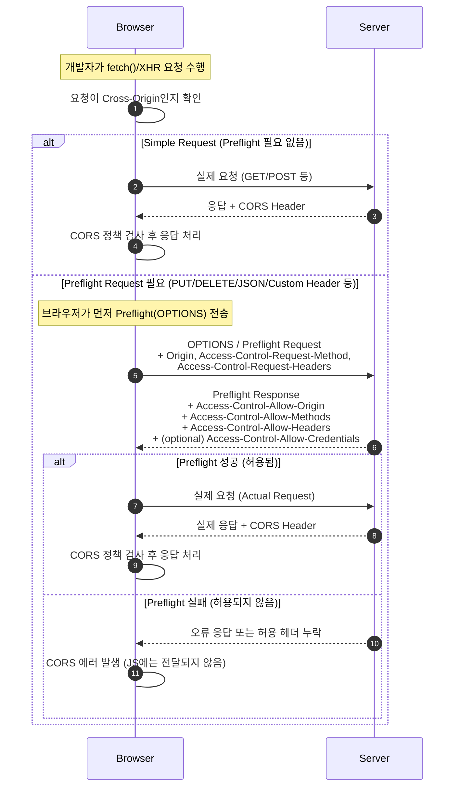

# 웹의 기본 원리 이해

## HTTP 동작 원리
HTTP는 Hyper Text Transfer Protocol로, 웹 리소스를 요청/응답하기 위한 프로토콜입니다.

### HTTP 특징

| 특징                   | 설명                                                                    |
| -------------------- | --------------------------------------------------------------------- |
| 클라이언트-서버 구조          | 서버가 먼저 메시지를 시작하지 않음.                                                  |
| Stateless            | 서버는 각 요청 간 사용자의 상태를 기억하지 않는다.                                         |
| Request - Response기반 | HTTP는 반드시 클라이언트가 요청을 시작해야 함.                                          |
| Connectionless       | HTTP 1.0은 **요청 → 응답 → 연결 종료** 형태였으나 http 1.1의 keep-alive 속성으로 의미가 약해짐 |
| 텍스트 기반 프로토콜          | 요청과 응답이 사람이 읽을 수 있는 텍스트 문자열로 이루어짐.                                    |


> keep-alive: 한 번 생성한 TCP 연결을 여러 HTTP 요청/응답에 재사용하도록 하는 메커니즘이다.
#### 어떻게 keep-alive가 TCP handshake를 하지않고 바로 연결할까?
한 번 handshake로 만들어진 TCP 연결을 끊지 않고 재사용하기 때문에 이후 요청에서 handshake 과정이 생략되는 것입니다

연결에 대한 관리는 OS(커널)레벨에서 관리합니다

#### ❓ 커널에서 어떻게 관리하나요?
커널은 TCP 연결을 “소켓 테이블(Socket Table)”로 관리합니다.
3-way handshake로 연결이 성립되면 커널은 해당 연결을
(local IP, local port, remote IP, remote port, protocol)
다섯 가지 정보를 기반으로 Connection 상태를 기록하고,
상태 머신(TCP State Machine)에 따라 연결을 유지하거나 종료합니다.
HTTP keep-alive는 이 TCP 연결을 재사용하므로
커널은 같은 소켓을 TIME_WAIT 또는 CLOSE되기 전까지 유지하여
애플리케이션이 다시 연결을 만들지 않고 바로 쓰도록 합니다.

> 소켓: 유닉스에서는 “모든 것은 파일”이라는 철학을 가지고 있으며,
소켓 또한 커널 내부에서 파일 디스크립터로 표현됩니다.
그래서 소켓에 대해 read(), write(), close() 같은 파일 시스템 호출을 그대로 사용할 수 있습니다.

TCP Keep-Alive든 HTTP Keep-Alive든
커널은 동일한 5-튜플로 식별되는 TCP 소켓 객체를 그대로 유지하며
이를 “ESTABLISHED 상태”로 두고 재사용할 수 있도록 관리한다.
실제 Keep-Alive 만료 여부는 커널의 idle timer나
HTTP 서버의 keepalive_timeout 설정에 따라 결정된다.

HTTP 레이어에서는 단지 소켓을 닫지 않고 유지할지 결정할 뿐이며,
실제 연결 유지·해제는 전적으로 커널이 처리합니다.



#### ❓ Keep Alive 동안 많은 소켓이 연결될수도 있지 않을까요?
소켓 수 제한은 OS의 **FD, 커널 메모리, ephemeral port** 등으로 결정됩니다
많은 소켓을 연결을 관리해야하는 경우 리눅스의 epoll로 비동기 소켓관리가 가능합니다.
nodejs, nginx, redis, kafka에서 지원합니다

> epoll: 많은 소켓 중 데이터가 “있는 소켓만” 알려주는 고성능 I/O 이벤트 감시 시스템이다.
select/poll과 달리 소켓 개수에 영향을 거의 받지 않는다(O(1)).


#### ❓ 브라우저는 몇개의 소캣을 사용해 연결하나요? (6 connections per host)
브라우저는 한 도메인(Host)당 최대 6개의 TCP 연결만 허용한다.
이는 오래된 HTTP/1.1 병렬 다운로드 최적화 규칙이며,
네트워크 혼잡 제어, 서버 과부하 방지, 공정성 확보를 위한 정책이다.


## 쿠키 / 세션 / JWT 구조

### 쿠키란?
쿠키(Cookie)는 웹 서버가 클라이언트(브라우저)에 저장하는 작은 데이터로,
HTTP가 Stateless이기 때문에 발생하는 ‘상태 유지 문제’를 해결하기 위해 사용됩니다.
브라우저는 저장된 쿠키를 동일한 도메인으로 요청할 때 자동으로 전송하여
서버가 사용자를 식별하거나, 로그인 상태 유지, 설정 저장 등을 할 수 있게 합니다.

### 쿠키의 구성요소
```
Set-Cookie: sessionId=abc123; Path=/; Expires=Wed, 21 Oct 2025; 
            HttpOnly; Secure; SameSite=Lax
```

| 이름                | 설명                                   |
| ----------------- | ------------------------------------ |
| name=value        | 쿠키의 실제 데이터                           |
| Path              | 어떤 경로에서 쿠키를 포함할지 결정                  |
| Domain            | 어떤 도메인에서 쿠키를 전송할지 결정                 |
| Expires / Max-Age | 쿠키 만료 시점 (Max-Age: 초단위)              |
| HttpOnly          | JavaScript에서 document.cookie로 접근 불가능 |
| Secure            | HTTPS 요청시에만 전송                       |
| SameSite          | CSRF 방어                              |
브라우저 내부에 쿠키가 저장됩니다

### 쿠키종류

| 이름                | 설명                               |
| ----------------- | -------------------------------- |
| session cookie    | 브라우저 세션동안 유지되는 쿠키                |
| persistent cookie | Expires 또는 Max-Age가 있으며 재시작해도 유지 |
| Secure Cookie     | HTTPS에서만 전송됩니다                   |
| HttpOnly          | JS에서 접근이 불가능한 쿠키입니다              |


### ❓ 왜 HttpOnly를 설정하면 JS에서 접근이 안될까?
HttpOnly는 브라우저가 JavaScript에서 접근할 수 없도록 “강제로 차단하는” 쿠키 속성이다.
이유는 XSS 공격이 발생해도 공격자가 쿠키의 값을 읽을 수 없도록 하기 위해서이며,
브라우저가 DOM API(document.cookie)를 통해 HttpOnly 쿠키를 절대 노출하지 않도록 설계되어 있다

브라우저는 쿠키를 하드디스크의 SQLite 기반 Cookie Store에 저장하고,
이를 메모리 캐시에 올려 빠르게 조회한다.

document.cookie 를 실행했을때 브라우저가 컴퓨터의 Cookie Store에서 쿠키를 읽어들이고, 그중 isHttpOnly만 제외하여 JS에 전달한다.

네트워크 스택에서도 동일하다.
네트워크 요청을 보낼때 네트워크 스택에서 Cookie Store에서 도메인에 맞는 쿠키를 읽어들이고 포함시켜 요청한다.


### ❓ 세션쿠키가 어떻게 브라우저세션에서만 유지가될까?

세션 쿠키는 Expires 또는 Max-Age 속성이 없는 쿠키이다.
브라우저는 이러한 쿠키를 디스크가 아니라 메모리(세션 메모리)에만 저장하고,
브라우저 프로세스가 종료되면 메모리가 사라지므로 쿠키도 자동으로 삭제된다.
이 때문에 “브라우저 세션 동안만 유지되는 쿠키”가 되는 것이다.

쿠키 명세(RFC6265)에서:
`“만료 정보가 없는 쿠키는 영구 저장하면 안 된다. 유효기간이 세션 동안으로 한정된다.”`
즉 표준 명세에 따라 브라우저가 저장소에 기록하지 않도록 되어 있음.

### ❓ SameSite Lax, Strict, None의 차이점이 무엇인가?
Cross-Site 요청에 대해 쿠키를 자동으로 보내줄지 말지를 결정하는 보안 정책.
CSRF를 방어하기 위해 도입되었다.

| **옵션**     | **Cross-Site 요청에서 쿠키 전송?**                       | **주요 사용 사례**                                                                         |
| ---------- | ------------------------------------------------ | ------------------------------------------------------------------------------------ |
| **Strict** | ❌ 전혀 전송 안 함                                      | 가장 강력한 보안 / 민감한 인증 (인증쿠키)                                                            |
| **Lax**    | ⭕ **GET 같은 “top-level navigation”은 허용**, 그 외는 차단 | 대부분의 로그인 유지 쿠키 기본값, 위험한 요청(POST, DELETE) 같은 요청은 쿠키를 포함하지않음, iframe도 불가. OAuth처리시 사용됨 |
| **None**   | ⭕ 모든 cross-site 요청에서 전송                          | 제3자 도메인에서 쿠키 필요할 때 (iframe, CDN, OAuth 등) — 단 Secure 필수                              |


## REST / RESTful API

REST(Representational State Transfer)는 웹 리소스를 “자원(Resource)”으로 보고,
HTTP 메서드(GET/POST/PUT/DELETE 등)와 URI를 통해 자원을 표현하고 조작하는 아키텍처 스타일입니다.
RESTful API란 이 REST 원칙들을 잘 지켜서 설계한 API를 말하며,
리소스 중심의 URI, 표준 HTTP 메서드 사용, Stateless, 캐싱 가능 등의 특징을 가집니다.

### REST 제약조건

#### Client-Server
클라이언트와 서버의 역할을 분리한다.
서로 독립되어 서버를 바꿔도 클라이언트가 영향을 받지않고, 반대도 마찬가지로 영향을 받지 않도록 한다

#### Stateless
서버는 각 요청을 독립적으로 처리한다
이전 요청 정보를 서버에 보관하지 않으므로 서버의 상태관리 비용이 없다.
클라이언트는 필요한 정보(토큰)을 포함해서 보내도록 하여 요청이 하나의 단위로 완결될수 있도록 한다

#### Cacheable
서버 응답에 이 응답을 캐시해도 되는지/안되는지 를 명시한다
캐시 가능한 응답은 클라이언트나 중간 Proxy가 재사용 가능하다. 트래픽 절감, 응답속도 향상, 서버 부하를 감소시킨다.

#### Uniform Interface
인터페이스의 일관성으로 클라이언트/서버 API가 명확하고 예측 가능
- Resource Identifier - URI로 리소스 식별
- Manipulation Through Representations - JSON, XML 등 표현을 통해 자원 조작
- Self-Descriptive Message 메시지 자체에 데이터 + 처리방식 정보를 포함 (Content-Type)
- Hypermedia as the Engine of Application State (HATEOAS) 응답안에 다음 가능한 행동 링크 포함

#### Layered System 계층화 시스템
클라이언트는 일반적으로 최종 서버에 직접 연결되어 있는지, 아니면 중간 중개 서버에 연결되어 있는지 알 수 없습니다. 중개 서버는 부하 분산을 활성화하고 공유 캐시를 제공하여 시스템 확장성을 향상시킬 수 있습니다. 계층은 보안 정책을 시행할 수도 있습니다.


#### Code On Demand (선택사항)
서버가 클라이언트에게 실행 가능한 코드를 보내서 기능을 동적으로 확장 가능
- 예: 서버가 JavaScript를 내려 클라이언트 기능 보강


### ❓ Code On Demand를 보고 생각난건데, js 번들을 분리해서 내려주는 Code Spliting  기법이 있다. 이부분도 Code On Demand로 볼수있는걸까?

JS 번들 분리나 lazy-loading은 클라이언트가 서버에서 코드를 받아 실행한다는 점에서
REST의 Code on Demand 철학과 유사합니다.
하지만 REST에서 말하는 CoD는 API를 통한 클라이언트 기능 확장이라는 의미이고,
번들 분리 기법은 앱의 빌드/배포 최적화 전략이기 때문에
엄밀히 말해 REST CoD라고 하긴 어렵습니다.

다만 “서버가 클라이언트로 실행 코드를 전달하여 동작을 정의한다”는 관점에서는
현대 웹은 느슨한 의미의 CoD 구현이라고 볼 수 있습니다.

## URL/URI/URN 개념 구분
URI는 리소스를 식별하는 모든 식별자를 말하고,
URL은 리소스의 ‘위치(주소)’를 나타내는 URI의 한 종류이며,
URN은 리소스의 ‘이름’을 나타내는 URI의 한 종류입니다.
즉, URI = URL + URN(을 포함한 상위 개념)입니다.

### URL(Uniform Resource Locator)
URL은 반드시 리소스의 접근 방법(프로토콜) + 위치(호스트/경로)를 포함해야 한다.
```
https://example.com/users/10
ftp://myserver.com/file.txt
```

### URN
어디에 있는지 몰라도, **그 리소스를 유일하게 식별할 수 있는 이름**을 의미한다.
```
urn:isbn:0451450523
urn:uuid:6e8f9a8e-1234-4e9a-bb23-b6e70de5c123
```
책 ISBN번호나 고유 UUID 값 같은 위치가 변해도 이름은 변하지 않는 식별 방식이다.

### ❓ AWS의 ARN(Amazon Resource name)
URN의 역할은 AWS가 자체적으로 정의한 ARN(Amazon Resource Name)이 수행합니다.
ARN은 AWS 리소스를 전역적으로 유일하게 식별하기 위한 이름 기반 식별자 입니다.


---

# 보안 기초
## origin의 구성요소
프로토콜(http/https) + 도메인 + 포트
프로토콜, 도메인, 포트가 다른경우 같은 origin으로 평가하지 않습니다


## SOP(Same Origin Policy)
브라우저가 서로 다른 출처(origin)간의 중요한 리소스 (쿠키, DOM, LocalStorage등) 을 공유하지 못하게 막는 보안정책 입니다

이 정책으로 인해 악성사이트가 다른 도메인의 쿠키값에 접근하거나, LocalStroage를 접근하는것을 막을수 있습니다.

## CORS(Cross Origin Resource Sharing)
서로 다른 출처간 요청이 필요한경우 특정 Origin을 허용하도록 명시해 SOP를 부분적으로 완화하는 메커니즘입니다.

### CORS 동작구조

1. 클라이언트에서 요청을 보낼때 브라우저가 SOP를 체크합니다
2. SOP위반 가능성이 있으면 Preflight Request(OPTIONS)를 전송합니다
3. 서버가 다음 헤더를 포함해 응답합니다
	1. Access-Control-Allow-Origin: https://client.com
	2. Access-Control-Allow-Credential: true
	3. Access-Control-Allow-Methods: GET, POST, PUT, DELETE
	4. Access-Control-Allow-Headers: Content-Type, Authorization
4. 클라이언트가 허용되는 origin인경우 요청을 마저 보냅니다
5. 실패하는경우 CORS 오류로 요청을 차단합니다.

simple request의 경우 preflight request를 보내지않고 바로 요청을 보냅니다.
응답이 CORS를 허용하지 않는 헤더라면 JS에 전달하지않고 CORS 오류로 브라우저를 차단합니다

### Access Control Allow 헤더

| 이름          | 설명                                                                |
| ----------- | ----------------------------------------------------------------- |
| Origin      | 어떤 origin을 허용할지                                                   |
| Credentials | 쿠키를 포함한 인증정보를 허용할지                                                |
| Methods     | 허용할 HTTP 메서드                                                      |
| Headers     | 허용할 헤더                                                            |
| Max-Age     | Preflight를 캐싱하는 시간(초)입니다. 이 시간동안은 같은요청에 대해 Preflght를 다시 보내지 않습니다. |

### Preflight Request
Preflight Request는 브라우저가 Cross-Origin 요청을 보내기 전에,
서버가 해당 요청을 허용하는지 확인하기 위해 먼저 보내는 “사전 검증 요청(OPTIONS)“이다.
브라우저는 서버가 올바른 CORS 허용 헤더를 응답하면 그때서야 실제 요청을 전송한다

### SImple Request와 Preflight Request
| **구분**           | **Simple Request**                                     | **Preflight Request** |
| ---------------- | ------------------------------------------------------ | --------------------- |
| OPTIONS 요청 발생 여부 | ❌ 없음                                                   | ✔ 있음                  |
| 브라우저가 위험하다고 판단?  | 아니오                                                    | 예                     |
| Method           | GET, POST, HEAD                                        | PUT, DELETE, PATCH 등  |
| Content-Type     | x-www-form-urlencoded, text/plain, multipart/form-data | application/json 등    |
| Custom Header 사용 | ❌ 불가                                                   | ✔ 가능                  |
| 속도               | 빠름                                                     | OPTIONS 한 번 더 필요 → 느림 |
| 서버 요구사항          | Allow-Origin만 있으면 됨                                    | Allow-* 헤더 다 필요함      |


### CORS 동작구조 mermaid




## XSS
XSS(Cross-Site Scripting)는 공격자가 웹 페이지에 악성 스크립트를 삽입하여
다른 사용자의 브라우저에서 실행되도록 만드는 공격입니다.

주로 입력값 검증 미비가 원인이며,
쿠키 탈취, 세션 하이재킹, 화면 변조, 피싱, 악성 요청 실행 등이 가능합니다.
방어는 입력값 검증, 출력 시 Escape, CSP 적용 등이 핵심입니다.


### Stored XSS (저장형 XSS)
공격자가 게시글에 악성스크립트를 작성하여 저장하고, 다른사용자가 그 게시글을 열떄 서버에서 악성코드가 그대로 내려와 브라우저에서 실행됨

예를들어, 게시물에 자바스크립트 코드를 삽입하여 업로드하여, 사용자의 브라우저로 접속했을때 사용자 브라우저의 쿠키값이나 localStorage값을 탈취하여 자신의 서버로 요청을 보낼수있음

### Reflected XSS(반사형 XSS)
악성스크립트가 요청에 포함되고 서버가 그대로 응답하는 형태
URL Query에 스크립트를 넣어 유도하는 패턴이 많음

### DOM-based XSS
서버가 아닌 브라우저 Javascript 코드에서 발생

## XSS 보안
신뢰할 수 없는 입력값을 신뢰할 수 있는 출력으로 렌더링했기 때문에 입력에 대한 보안과 브라우저 보안을 활용해 XSS를 막을 수 있습니다.

### 출력시 Escape 인코딩
HTML값을 삽입할때 HTML Entity로 변환해야 합니다
`<script>alert(1)</script>` 를 `&lt;script&gt;alert(1)&lt;/script&gt;` 형태로 변환하여 주입돤 javascript를 브라우저에서 실행되지 않도록 합니다.

### HttpOnly Cookie 사용
세션 쿠키는 js에서 접근하지 못하도록 HttpOnly쿠키를 사용합니다

### CSP (Content Security Policy)
```
Content-Security-Policy: default-src 'self';
```
CSP는 브라우저에 “이 페이지에서 어떤 리소스만 로드/실행 가능한지”를 명시하는 보안 정책이다.
XSS 방어에 매우 효과적이며, script-src, default-src, nonce/hash 기반 inline control 등이 핵심이다.
올바른 CSP는 대부분의 XSS 공격 벡터를 원천 차단한다.

CSP는 서버가 HTML 문서를 응답할 때 함께 내려주는 보안 헤더(HTTP Response Header)이며,
브라우저는 HTML을 파싱하기 전에 이 헤더를 읽고 페이지 전체에 적용합니다.
즉, HTML 렌더링 “시작 시점”에 브라우저가 적용하는 정책입니다.


| 이름          | 설명                                                                                                                                                                        |
| ----------- | ------------------------------------------------------------------------------------------------------------------------------------------------------------------------- |
| default-src | CSP정책의 기본값을 정의합니다. 이미지, 스크립트, 스타일, iframe, 폰트 등전체 리소스의 기본 허용정책입니다 self) 현재 도메인에서만 가져올수 있습니다. 외부 CDN, 외부 이미지는 차단합니다                                                        |
| script-src  | javascript 파일을 어떤 출처(origin) 에서 로드할수 있는지, 어떤방식으로 실행할 수 있는지를 정하는 정책이다. 외부스크립트, 인라인스크립트, onclick같은 inline 이벤트핸들러, eval같은 동적코드 실행, js import, worker script 허용에 대해 제어가 가능합니다 |
| nonce       | 서버가 매 요청마다 랜던 nonc 문자열을 생성하고 HTML script 태그에 nonce를 넣어 예외적으로 실행을 허용하는 방식, 이때 nonce 는 매 요청마다 새로 생성되어야 합니다                                                                  |
| hash        | inline script를 해시하여,ㅡ 그 해시값과 동일한 스크립트만 허용하는 방식                                                                                                                            |

#### nonce 예)
```
## 응답 헤더
Content-Security-Policy: script-src 'self' 'nonce-a1b2c3';

## 브라우저 JS -- 이부분은 실행이 됩니다. 허용되는 nonce가 있어서
<script nonce="a1b2c3">
  console.log("Inline script allowed");
</script>
```
#### hash 예)
```
## 응답 헤더
Content-Security-Policy: script-src 'self' 'sha256-AbCdEf...';

## 스크립트코드
<script>
  console.log("This exact script is allowed"); // SHA256으로 해싱한값이랑 동일한경우 실행됨
</script>
```
브라우저는 script 내용을 hash 계산하여
CSP에 있는 hash와 일치하면 실행한다.


### 사용자 입력값 검증
사용자 입력값이 허용된 문자열로 이루어져있는지 검증합니다.

### innerHTML 대신 textContent 사용
DOM 기반 XSS를 방지합니다.


### Q. React/Vue/Next.js에서 nonce 기반 CSP 설정 패턴


## CSRF
CSRF(Cross-Site Request Forgery - 포저리, 위조)는 사용자가 로그인된 상태를 악용하여,
공격자가 의도한 요청을 피해자가 모르게 실행하도록 만드는 공격입니다.
브라우저가 자동으로 쿠키를 첨부하는 특징을 이용하는 공격이며,
방어는 CSRF Token, SameSite 쿠키, Referer/Origin 검증 등이 핵심입니다.

예를들어, 해커 사이트에서 A.com 사이트로 요청을 보낸다고 가정한다면, A.com의 쿠키값을 포함해서 브라우저가 요청을 보내게 됩니다.

이를 이용해 해커사이트에서 유저의 특정도메인의 쿠키를 이용해 요청을 보내고 응답을 받을수있습니다.

가능한 이유는
- 쿠키기반 인증 사용
- 서버가 Origin/Referer 을 확인하지않음
- 상태 변화나 요청(POST, DELETE,  PUT)이 보호되지 않음

## CSRF 막는법

| 방법                  | 설명                                                                                                    |
| ------------------- | ----------------------------------------------------------------------------------------------------- |
| CSRF Token          | 서버가 랜덤한 토큰을 HTML 폼이나 JS에 넣어주고 요청시 다시 제출하도록 요구합니다                                                      |
| SameSite Cookie     | SameSite레 Lax를 설정하여 GET요청에는 쿠키설정, 위험한 요청(POST ..)은 차단 합니다 strict를 설정하여 외부사이트의 요청은 모두 쿠키전송을 금지시킬수 있습니다 |
| Origin/Referer 헤더검증 | 브라우저는 조작 불가능한 요청자 링크를 가진 Referer 헤더를 보냅니다 이 URL로 CSRF인지 확인이 가능합니다                                     |


## SQL Injection
SQL Injection은 사용자가 입력한 값이 SQL 쿼리 문자열에 그대로 포함되면서
공격자가 의도한 SQL이 실행되도록 만드는 공격입니다.
이를 통해 인증 우회, 데이터 조회/수정/삭제, DB 파괴가 가능하며,
방어는 Prepared Statement(Parameterized Query), ORM, 입력 검증이 핵심입니다.

### SQL Injection 방어방법

| 방법                 | 설명                              |
| ------------------ | ------------------------------- |
| Prepared Statement | 입력값을 쿼리문자열이 아닌 데이터로만 처리하기       |
| ORM 사용             | 내부적으로 Parameterized Query를 사용함  |
| 입력 검증              | 입력길이 제한, 허용문자만 허용하는 whitelist방식 |
| DB권한 최소화           | 공격을 성공하더라도 피해를 최소화한다            |
Prepared Statement가 가장 근본적인 해결책이다

## HTTPS와 암호화 기법
HTTPS는 HTTP 요청/응답을 TLS(SSL) 프로토콜 위에서 암호화하여 통신의 기밀성, 무결성, 서버 인증을 보장하는 프로토콜입니다.
TLS는 대칭키 암호화(빠름)와 비대칭키 암호화(안전함)를 조합해 세션키를 교환하고, 이후 데이터는 대칭키로 암호화합니다.
인증서는 서버가 신뢰할 수 있는 기관(CA)에 의해 검증되었음을 증명해 MITM 공격을 방지합니다.


---

# 서버 아키텍처 이해

## 프록시 
프록시(Proxy)는 클라이언트와 서버 사이에 중간에 위치해
요청을 대신 전달해주는 중개 서버입니다.

## 포워드 프록시
클라이언트를 대신해 외부와 통신하면 ‘포워드 프록시’,
포워드는 클라이언트 보호/캐싱/필터링에 사용됩니다

```
Client → Forward Proxy → Server
```

예시) VPN

## 리버스 프록시
서버 앞에서 서버를 대신해 통신하면 ‘리버스 프록시’라고 부릅니다.
리버스는 서버 보호/로드밸런싱/SSL 종료에 사용됩니다.
Nginx, Apache HTTP Server, AWS ALB, NLB, Cloudflare 등이 리버스프록시의 예시

```
Client → Reverse Proxy → (Server A / Server B / Server C ...)
```


## CDN(Content Delivery Network)
전 세계에 분산된 캐시 서버 네트워크를 통해 정적 파일(이미지, JS, CSS, 동영상 등)을
사용자와 가까운 위치에서 제공하여 속도·안정성·대역폭 절감을 달성하는 기술.

Edge 서버 기반 보안 기능의 역할도 할수있어 DDos 방어, Bot, Rate limiting, WAF를 제공한다.

### Q. CDN의 동작원리

### Q. 어떻게 DDos를 방어할수 있는가

### CDN 캐시전략

#### Cache-Control 헤더
```
Cache-Control: max-age=3600
```

|**지시자**|**의미**|
|---|---|
|max-age|캐시 유효 시간(초)|
|s-maxage|CDN 같은 공유 캐시 전용 max-age|
|public|누구나 캐시 가능|
|private|브라우저만 캐시, CDN은 캐시하면 안됨|
|no-cache|캐시 저장 OK, **사용 전에 재검증 필요**|
|no-store|CDN과 브라우저 모두 캐시 금지|
|must-revalidate|만료되면 반드시 재검증|

#### E-Tag(Entity Tag)
파일 버전 관리용 고유 식별자

If-None-Match 헤더로 고유식별자를 비교하고 바뀌지 않았다면 304 Not Modified를 응답합니다


#### Last Modified / if-Modified-Since
최종 변경시간을 기반으로 재검증하는 방식

#### CDN TTL (캐시 유지시간)
Cloudflare, CloudFront 등 CDN은 원본의 Cache-Control을 무시하고 자체 TTL을 적용할수도 있다
정적파일 (JS, CSS, 이미지) 는 적극적으로 캐싱하고 HTML같은 동적컨텐츠는 캐싱을 하지않는 방식으로 edge network에 응답을 빠르게 하고 origin의 부하를 줄일수있다.


##  로드 밸런싱

하나의 서비스에 대한 요청을 여러 서버로 분배해 서버 과부하를 막고
고가용성(HA)과 확장성(Scalability)을 제공하는 기술.

Round Robin, Least Coneections, IP hash, Weighted Routing으로 요청처리를 분산처리할수있다.

## 웹 캐시 전략
웹 캐시 전략은 브라우저, 프록시, CDN 등이 서버로부터 받은 리소스를 저장하고
재사용하는 방식(캐싱 정책)을 설계하는 것을 말한다.
대표 전략은 Expiration(만료 기반), Validation(재검증 기반), 캐시 무효화 전략, 그리고 정적 자원 버전 전략이다.
핵심은 Cache-Control, Expires, ETag, Last-Modified 헤더를 조합해
적절히 캐싱·재검증·무효화를 설계하는 것이다.

|**위치**|**예**|
|---|---|
|브라우저 캐시|Chrome/Edge/Firefox|
|중간 프록시 캐시|회사 프록시, ISP|
|CDN 캐시|Cloudflare, CloudFront|

### Cache Control은 어디서 캐시를 관리하나요?
Cache-Control은 서버가 내려주는 캐싱 정책으로,
실제 캐싱 동작은 브라우저와 CDN 같은 캐시가 수행합니다.
서버는 캐시를 직접 저장하거나 참조하는 것이 아니라
캐싱 규칙을 정의하는 역할만 합니다.

---


# 인증/인가
인증은 사용자의 신원을 확인하는 것, 인가는 인증된 사용자가 어떤 권한을 가지는지 확인하는 것이다.
인증 없이는 인가가 이루어질 수 없으며, 인증은 Who?, 인가는 What?에 대한 답이다.

인증:
•	암호학(해시 매칭)
•	OAuth2 로그인
•	세션 기반(JSESSIONID)
•	JWT 서명 검증
•	MFA/OTP

인가:
•	Role 기반 접근 제어(RBAC)
•	Policy 기반(PBAC, ABAC)
•	ACL(Access Control List)
•	사용자별 Scope(OAuth2 Scopes)


### ❓ AWS, GCP, Azure 같은 클라우드에서는 Policy를 어떻게 관리하는가
AWS, GCP, Azure는 모두 정책 기반 접근 제어(PBAC / Policy-Based Access Control)) 를 사용하며
정책 문서를 JSON으로 정의하고 IAM Policy Engine이 매 요청을 평가한다.
AWS는 Action/Resource/Condition 기반의 강력한 정책 모델을 사용하며,
GCP는 Role 중심이지만 조건부 정책으로 PBAC를 지원하고,
Azure는 RBAC + Compliance Policy로 구성된다.
인증은 JWT, 인가는 클라우드 IAM Policy가 담당한다.

JWT에는 인증만 담당하고 인가권한은 IAM Policy에서 추가로 처리한다고 보면된다


## JWT + Refresh Token 전략
JWT는 짧은 만료시간을 가진 Access Token으로 인증을 수행하고,
Refresh Token은 긴 만료시간을 가지고 Access Token을 재발급하는 역할을 한다.
이 조합을 통해 보안성과 사용자 경험(자동로그인)을 동시에 만족시킬 수 있다.
Refresh Token은 반드시 서버 저장소 또는 안전한 저장 방식으로 관리해야 하며,
Access Token은 재발급 받는 용도로만 사용한다.

| **토큰**            | **목적**           | **저장 위치**                          | **만료 기간**         | **탈취 시 피해**   |
| ----------------- | ---------------- | ---------------------------------- | ----------------- | ------------- |
| **Access Token**  | API 인증           | 메모리(in-memory) 또는 Authorization 헤더 | 매우 짧게 (5~30분)     | 낮음 (짧은 만료)    |
| **Refresh Token** | Access Token 재발급 | HttpOnly Secure Cookie OR 서버 DB    | 길게 (7일~30일+보통 2주) | 매우 높음 → 보호 필수 |

### ❓  JWT 구조
JWT는 Header, Payload, Signature의 세 부분으로 되어 있으며,
Header와 Payload를 Base64URL 인코딩하고 secret 또는 private key로 서명하여
토큰의 무결성을 보장하는 구조입니다. Payload는 암호화되지 않기 때문에
민감한 데이터는 넣지 않는 것이 원칙입니다.

| **파트**        | **내용**      | **역할**             |
| ------------- | ----------- | ------------------ |
| **Header**    | 토큰 메타데이터    | 어떤 알고리즘으로 서명했는지 명시 |
| **Payload**   | 클레임(Claims) | 사용자 정보, 만료 시간 등    |
| **Signature** | 서명값         | 토큰 변조 여부 검증        |
### ❓  JWT가 변조되었을때 어떻게 되는가

signature을 생성할때, 헤더와 내용과 secret값을 HMACSHA로 해시 기반 메시지 인증 코드 전달한다.
만약 payload나 header가 변조됬다면 변조된값을 암호화해서 signature과 비교했을때 변조여부를 확인할수있다.

> HMACSHA256: HMAC(Hash-based Message Authentication Code) 은 해시 함수(SHA256)를 기반으로 만든 메시지 위·변조 방지용 서명 알고리즘이다. 
> SHA256(SHA256(key + ipad, message), key + opad) 수식으로 이뤄져있어서 거의 역산이 불가능하다
> 암호학 이야기라 나중에 더 써야할듯


```
signature = HMACSHA256(
   base64UrlEncode(header) + "." + base64UrlEncode(payload),
   secret
)
```


### ❓ 서버에서 Refresh 토큰을 관리하는 방식 
서버는 Refresh Token을 반드시 저장하고 검증하는 구조를 가져야 합니다.
일반적으로 Redis나 DB에 Refresh Token을 저장하여
토큰이 유효한지, 만료되었는지, 회수되었는지 확인합니다.
Refresh Token을 사용할 때마다 새 Refresh Token을 발급하고
기존 토큰은 즉시 폐기하는 Rotation 전략을 사용하면
탈취 공격을 빠르게 탐지할 수 있습니다.

Access Token은 Stateless지만, Refresh Token은 반드시 Stateful하게 관리됩니다.

### ❓  Refresh Token Rotation
Refresh Token Rotation은 Refresh Token을 사용할 때마다 새로운 Refresh Token을 재발급하고,
이전 Refresh Token은 즉시 폐기하는 보안 기법입니다.
탈취된 Refresh Token이 재사용되면 서버가 “이미 사용된 토큰”으로 감지하여
공격을 신속하게 차단할 수 있습니다.
OAuth 2.1과 OIDC에서 권장하는 현대적 보안 방식입니다.

### ❓  OAuth2.1은 JWT관계
OAuth 2.1은 인증 프로토콜의 표준이고, JWT는 토큰 포맷입니다.
OAuth 2.1은 Access Token을 어떤 형태로 발급할지 강제하지 않지만
확장성·서버 부하 감소·검증 용이성 때문에
JWT(JSON Web Token)를 Access Token 형식으로 채택하는 것이 일반적입니다.

즉, OAuth는 프로토콜이고, JWT는 그 프로토콜에서 자주 쓰이는 표현 방식입니다.

### ❓  OpenID Connect(OIDC) 란 무엇인가
OIDC(OpenID Connect)는 OAuth 2.0 위에 구성된 “사용자 인증 계층” 표준입니다.
OAuth가 “권한 위임” 문제를 해결한다면,
OIDC는 여기에 “사용자 로그인 및 사용자 정보(ID Token)” 기능을 추가합니다.

OIDC의 핵심은 **ID Token(JWT 기반)**으로,
이를 통해 클라이언트가 사용자의 신원을 신뢰할 수 있게 됩니다.

### ❓  왜 MSA에서는 JWT를 쓰는가?
MSA는 여러 독립 서비스가 서로 호출하기 때문에
중앙 인증 서버에 매번 조회하는 방식(session store)은 확장성이 떨어집니다.

JWT는 Stateless하게 자체적으로 서명을 통해 검증 가능하므로
각 서비스가 독립적으로 인증을 처리할 수 있어
성능, 확장성, 장애 격리 측면에서 매우 유리합니다.

또한 여러 서비스 간 Trust를 구성할 때
public key로 검증 가능한 JWT는 가장 현실적인 선택입니다.


### ❓ OAuth는 무엇인가요
OAuth는 “권한 위임(Authorization Delegation)”을 위한 표준 프로토콜입니다.
사용자의 아이디·비밀번호를 공유하지 않고도
제3의 애플리케이션이 특정 리소스에 접근하도록 허가하는 방식입니다.

예를 들어, 사용자가 구글 비밀번호를 앱에 주지 않아도
앱이 “구글 Drive 파일 읽기” 같은 제한된 권한을 얻도록 해주는 것이 OAuth입니다.

OAuth = “사용자가 가진 리소스 접근 권한의 일부를
제3자 애플리케이션에게 위임하기 위한 인가 프로토콜”


## 세션 기반 인증과 비교
세션은 매 요청마다 사용자 로그인정보를 확인한다
JWT + Refresh Token은 Access token이 expire되지 않은동안 인가된 사용자라 가정한다. JWT만 검증한다.

세션은 로그인을 무효화하기 쉽고, JWT는 무효화하기 어렵다

쿠키기반 세션의 경우 CSRF에 취약하고, JWT는 XSS에 취약하다. (생각해보면 쿠키와 localstorage의 차이임)

Refresh Token을 쓰면 결국 서버가 상태를 가지게 되지만, AccessToken의 만료되지 않았다면 매 요청마다 세션검증을 하지 않아도된다.

## Token 탈취 시 대응 전략(Blacklist vs Short-lived token)
Access Token은 Short-lived 전략(아주 짧은 만료시간)
Refresh Token은 Blacklist(서버 저장 + 즉시 무효화)


---

# 분산시스템 장애대응패턴

## Resilience
Resilience(레질리언스) 는
시스템이 장애, 지연, 부하 등의 문제 상황에서도 계속 동작하거나 빠르게 복구할 수 있는 능력이다.

### Resilience 구성요소

| 이름                   | 설명                     | 예시                                 |
| -------------------- | ---------------------- | ---------------------------------- |
| Isolation(격리)        | 문제를 다른 컴포넌트로 전파시키지 않는다 | Bulkhead 패턴, Pool 분리               |
| Redundancy(중복)       | 장애가 나면 다른 노드/서버가 대신한다  | Failover, Multi-zone, Multi-region |
| Timeout & Backoff    | 느린 요청을 끊고 재시도하여 회복력 강화 | Retry + Timeout                    |
| Graceful Degradation | 일부 기능이 죽어도 전체는 유지      | Fallback, Cache Response           |


## Timeout
느린 요청을 빠르게 중단해서 장애확산을 막는 기본패턴
### Connection Timeout
클라이언트가 서버와 TCP 연결(3-way handshake)을 시도할 때,
일정 시간 안에 연결이 성립되지 않으면 포기하고 실패 처리하는 시간 제한이다.

### Read Timeout 
Read Timeout은 “요청은 성공했지만, 서버가 응답 데이터를 보내기 시작하지 않거나 다 보내지 못할 때까지 기다리는 최대 시간”이다.


| **항목** | **Connection Timeout** | **Read Timeout**     |
| ------ | ---------------------- | -------------------- |
| 언제 발생? | TCP 연결이 맺어지지 않을 때      | 서버의 응답이 늦을 때         |
| 요청은?   | 서버로 전달되지 않을 수도 있음      | 이미 서버까지 도착함          |
| 서버 상태  | 서버가 죽었거나 네트워크 단절       | 서버는 살아있지만 느림         |
| 예시     | SYN-ACK 미수신            | DB 지연, 로직 지연, 프록시 문제 |

## Retry 전략
요청 실패 시, 동일 요청을 일정 규칙에 따라 재시도하여
일시적인 네트워크 오류나 서버 장애를 회복하는 기법이다.
올바른 Retry는 Backoff + Jitter + 최대 횟수 + Idempotency가 필수

| **요소**                         | **설명**               |
| ------------------------------ | -------------------- |
| **1) 최대 재시도 횟수 (max retries)** | 1~3회가 일반적            |
| **2) Backoff(대기 시간 증가)**       | 재시도할 때마다 대기 시간 증가    |
| **3) Jitter(랜덤 지터)**           | 모든 요청이 동시에 몰리는 것을 방지 |
| **4) Idempotency(아이뎀포턴시)**     | 중복 요청해도 문제가 없도록      |
| **5) 실패 임계치 기반 중단**            | 일정 상황에서는 재시도하지 않음    |
지수 백오프에 랜덤지터를 추가하여 랜덤지연으로 요청을 보낼수 있도록 하는것을 권장한다


## Circuit Breaker
서킷 브레이커는 외부 시스템이 장애 상태일 때
재시도로 인해 더 큰 장애가 발생하지 않도록
호출을 빠르게 차단하는 보호 장치이다.

```
Closed → Open → Half-Open → Closed
```

#### Closed - 정상상태
모든 요청을 정상적으로 대상 서버에 전달함
실패치 < 임계치

#### Open - 차단상태
대상 서버가 지속적으로 실패하면 회로를 열어서 요청을 더이상 보내지않는다.
- 대상 서버에 추가 부하를 주지않기위해 요청을 즉시 실패처리한다.

#### Half-Open - 시험상태
일정 시간(Recovery Timeout)이 지난후 일부 요청만 다시 보내본다
성공하면 Closed로 복귀, 실패하면 Open 유지

## Bulkhead 패턴
이름은 배에서 차용됨, 여러 칸으로 나누어서 물이 한칸에 차도 배 전체가 침몰하지 않는구조
스레드 풀 분리, 커넥션 풀 분리, 서비스별 격리를 하여 한 서비스에서 장애가 나도 다른 서비스는 정상 동작하도록 격리하는 방법

## Rate Limiting - 요청 제한
너무 많은 요청이 몰릴 때 시스템이 죽지 않도록 요청수를 제한하는 패턴
Token Bucket, Leaky Bucket, Fixed Window, Sliding Window 알고리즘을 활용한다

## Load Shdding  - 부하 차단
서버가 과부하 상태가 되기 전에 일부 요청을 과감히 버려 전체 시스템을 보호하는 패턴


### Failover - 장애 발생시 자동전환
주 서버가 죽으면 자동으로 대체서버로 전환

### Saga Pettern - 분산 트랜잭션 복구
MSA 환경에서 트랜잭션 실패시 보상작업을 수행하여 데이터 정합성을 유지하는 패턴

### Queue 기반 비동기 처리 (Async Message)
요청을 큐(kafka, RebbitMQ, SQS)에 적재해서 백엔드가 천천히 처리하도록 하는 패턴

### Hedging Request (병렬요청)
특정 요청이 느리면 같은 요청을 다른 서버로 동시에 보내서 더 빠른 응답을 채택

### Timeouts + Retries + Circuit Breaker (Resilience 패턴의 기본 3종)
위에 설명한 3종 방법을 조합해서 안정성을 극대화할수있음


### ❓Idempotency-Key를 적용하여 POST를 retry-safe로 만드는 방법
> Idempotency: 같은 요청을 여러 번 보내도 결과가 동일하게 유지되는 성질.

POST는 기본적으로 비멱등이기 때문에 네트워크 타임아웃이나 재시도로 인해 중복 생성이 발생할 수 있습니다.
이를 방지하기 위해 클라이언트가 요청마다 Idempotency-Key를 생성해 서버에 전달하고,
서버는 이 키를 기준으로 요청 처리를 단 한 번만 수행한 뒤 결과를 저장합니다.
동일 키로 다시 요청이 오면 서버는 로직을 반복 실행하지 않고
저장된 응답을 그대로 반환하여 POST 요청을 retry-safe하게 만듭니다.

Idempotency key를 활용하여 DB나 redis같은 저장소에 조회하여 처리가 가능합니다
동시요청이 들어온다면 Mutex/Redis Lock 이 필요합니다


0.1 ms 이내 빠른요청으로 들어오는경우 DB에 idempotency key가 insert 되기전에 요청이 받아들여질수도 있습니다.

동시성 문제를 해결하기위해서는 아래와같은 방법이 있습니다
- Idempotency Key를 DB Unique 키로 중복요청을 처리하는 방법
- Redis SETNX 예비 Lock 기반 처리 - redis는 단일스레드 구조라 race condition이 발생되지 않는다
- Queue 비동기요청, producer가 duplaice key를 포함하는경우 consumer가 중복키 처리여부 체크 후 discard


# 참고
> https://www.restapitutorial.com/introduction/restconstraints


---
- ⭐️ 쿠키와 세션에 대해서 설명해주세요.
- JWT 토큰에 대해서 설명해주세요.
- JWT 토큰과 세션의 차이는 무엇인가요?
- 리프레시 토큰이 등장한 이유가 뭘까요?
- 리프레시 토큰의 도입으로 JWT 토큰이 상태를 갖게 되면, 세션과 어떠한 차이가 있나요?
- ⭐️ SOP와 CORS에 대해서 설명해주세요.
- ⭐️ REST에 대해서 설명해주세요. Restful API는 뭘까요?
- ⭐️ REST 제약 조건에 대해 설명해주세요.
- URL, URI, URN 차이가 뭘까요?
- XSS 공격이 무엇이고, 방어하는 방법을 설명해주세요.
- CSRF 공격이 무엇이고, 방어하는 방법을 설명해주세요.
- SQL Injection 공격이 무엇이고, 방어하는 방법을 설명해주세요.
- 웹 캐시에 대해 설명해주세요.
- 프록시 서버에 대해서 설명해주세요.
- ⭐️ 포워드 프록시에 대해서 설명해주세요.
- ⭐️ 리버스 프록시에 대해서 설명해주세요.
- 커넥션 타임아웃과 리드 타임아웃에 대해 설명해주세요.
 
