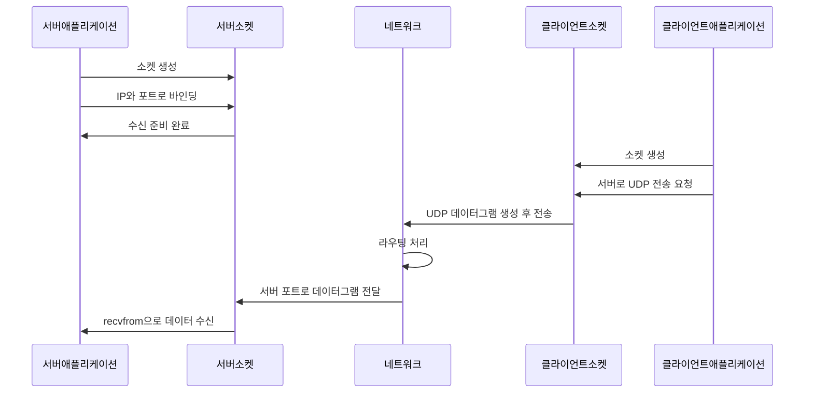
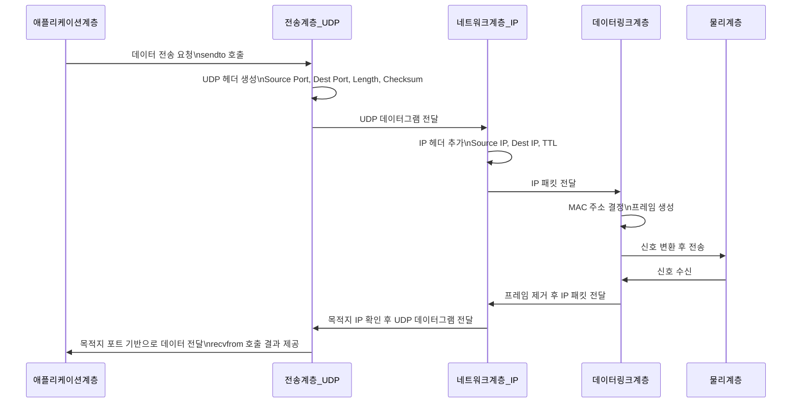
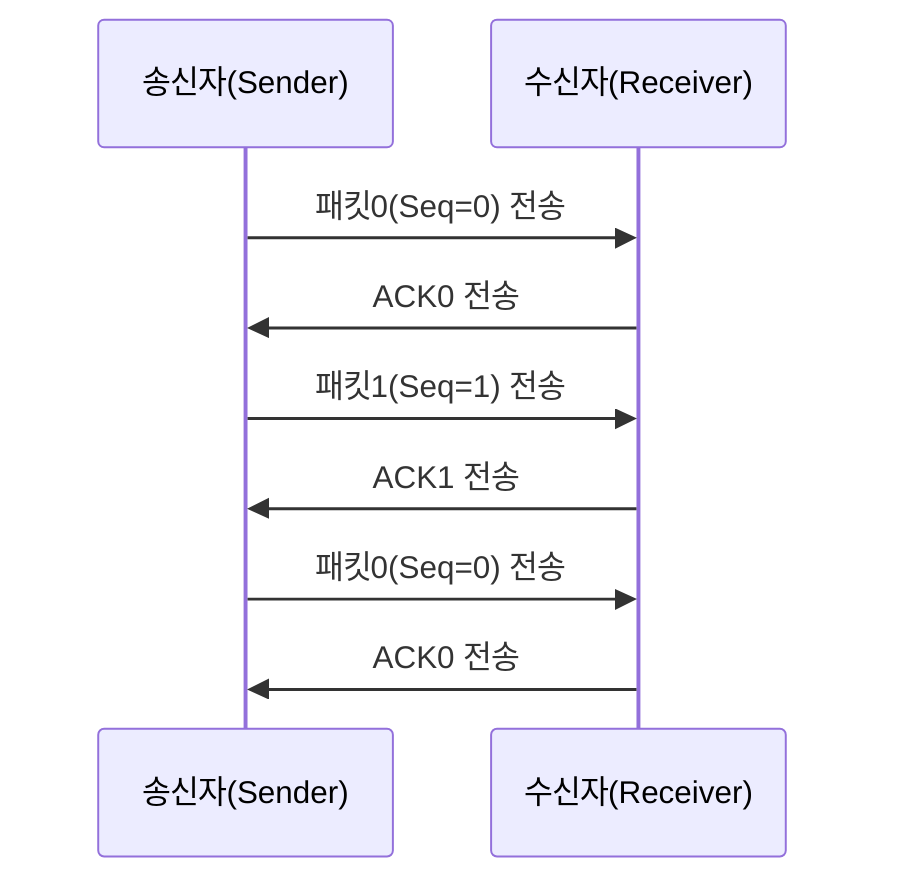
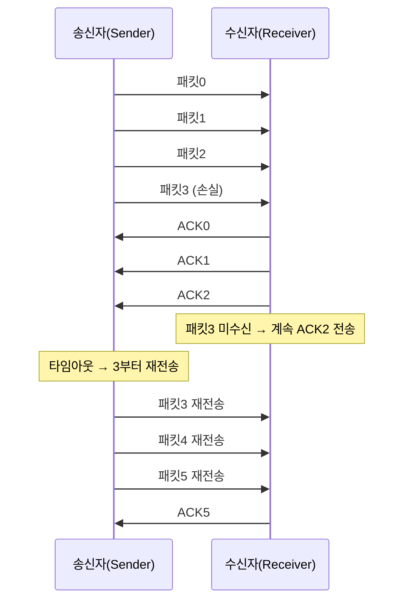
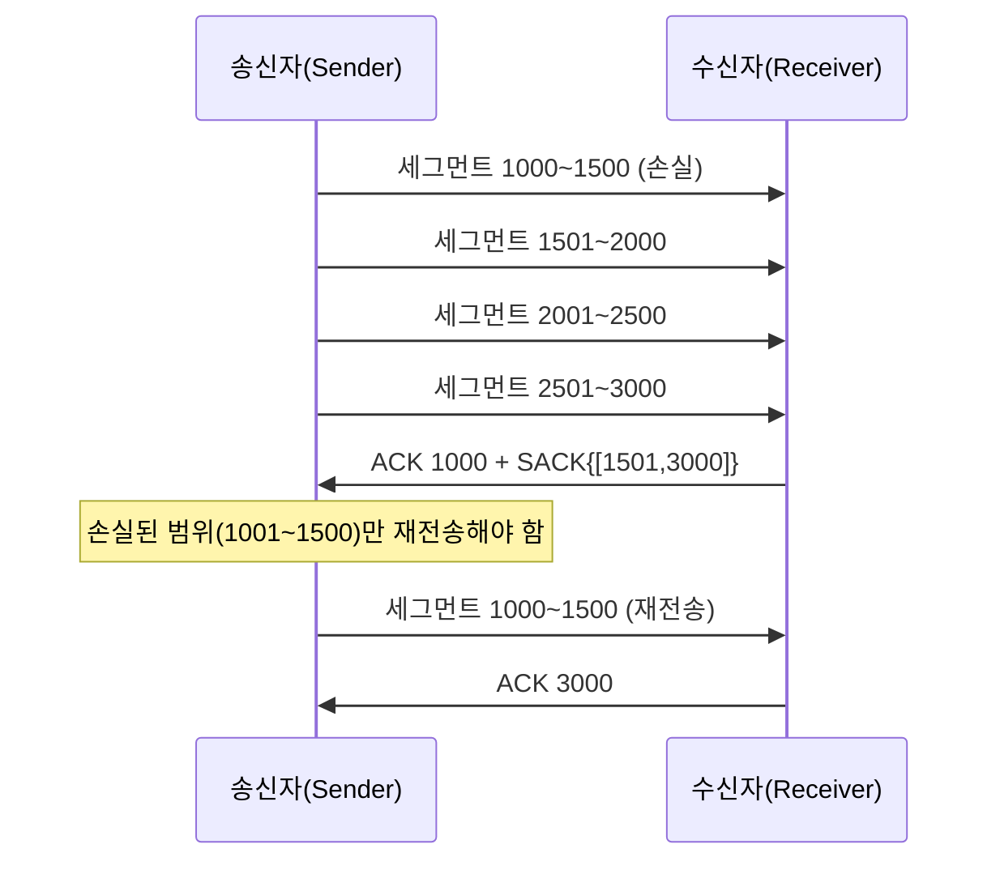

## 🧩 UDP

### UDP란
UDP(User Datagram Protocol)는 개별 패킷 단위인 **데이터그램(datagram)**을 그대로 전달합니다.

> 데이터그램: 독립적인 데이터 패킷, 순서 보장 없음

TCP와 다르게 연결하는 과정이 없고, 서버의 application layer에서 UDP 패킷을 받을 소켓을 특정 포트에 바인딩하고, 클라이언트 측에서 해당 서버의 IP와 포트로 데이터그램을 전달합니다.

> socket의 bind: OS가 소켓에 IP와 Port를 부여하여 커널은 해당 포트로 들어오는 패킷을 이 소켓에 전달



### UDP 구조 & 헤더 (유저 데이터그램)
UDP 데이터그램은 IP 패킷의 데이터 부분에 포함됩니다

```
[IP Header][UDP Header][UDP Data]
```

#### UDP Header (8Byte)

| **필드**           | **역할**         |
| ---------------- | -------------- |
| Source Port      | 발신 포트          |
| Destination Port | 수신 포트          |
| Length           | 헤더 + 데이터 전체 길이 |
| Checksum         | 데이터 손상 여부 검출   |

#### UDP Data()
UDP 데이터그램 전체 크기(UDP 헤더 + 데이터)는
IP 패킷의 최대 크기(65,535바이트) 안에 들어가야 합니다.

다만 실제로는 Ethernet의 MTU(최대 전송 단위)가 보통 1500byte이기 떄문에
1500바이트 이하인 패킷을 만들어 전달합니다

> MTU: IP 패킷 전체 크기(IP 헤더 + 상위 계층 데이터)

### OSI 7계층 기준으로 UDP가 처리되는 과정



UDP는 OSI 4계층인 전송계층에서 데이터그램을 전달받습니다.

UDP 전송계층에서는 아래와 같은 작업을 합니다
1. 애플리케이션 데이터 단위를 그대로 전송하기 위해 데이터그램 생성
2.  포트 번호를 통해 프로세스 구분 (Multiplexing / Demultiplexing)
3. 간단한 무결성 검사 (Checksum 계산)

UDP는 연결을 만들지 않고 단순히 데이터그램을 전달하는 구조이기 때문에 빠르고 가볍지만,
그만큼 신뢰성 보장 기능은 제공하지 않습니다.

####  어떻게 네트워크계층에서 UDP와 TCP를 구분할까요
IP 헤더의 Protocol 필드 값을 보고, TCP(6)인지 UDP(17)인지 구분한다.
네트워크 계층(IP)은 오직 IP 주소 + Protocol 번호만 보고 동작한다

### Connectionless(비연결형) 특성

UDP는 연결을 맺지 않고 데이터를 전송하는 방식이다.
즉, TCP처럼 연결 절차(3-way handshake)가 없다.

### Best-effort(최선형, 비신뢰성) 특성
네트워크는 “최선을 다해” 전달하지만, 보장(Guarantee)은 하지 않는다

| **항목**      | **UDP**  | **TCP**  |
| ----------- | -------- | -------- |
| 패킷 손실 없음    | ❌ 보장 안 함 | ✔ 재전송    |
| 순서 보장       | ❌ 없음     | ✔ 있음     |
| 중복 방지       | ❌ 없음     | ✔ 있음     |
| 전송 성공 여부 확인 | ❌ 없음     | ✔ ACK 존재 |
| 흐름 제어       | ❌ 없음     | ✔ 있음     |
| 혼잡 제어       | ❌ 없음     | ✔ 있음     |

애플리케이션이 직접 신뢰성을 구현해야 합니다

### UDP checksum

UDP Checksum 값은 pseudo-header 배열 + UDP Header + UDP Data를
16비트에 1’s complement 방식으로 모두 더한 뒤,
최종적으로 그 합의 1의 보수를 취해 만든 값입니다.
이렇게 계산된 값이 UDP Header의 Checksum 필드에 포함되어 전송됩니다.

전송 과정에서 데이터가 손상되었는지 확인하는 용도로 사용됩니다.
신뢰성 보장은 없지만 최소한의 무결성을 보장하는 장치입니다.

pseudo-header는 전송되는 실제 헤더가 아니라
Checksum 계산을 위해 송·수신 측에서 임시로 구성하는 12바이트의 가상 헤더로,
Source IP, Destination IP, Zero, Protocol, UDP Length로 이루어져 있습니다.

#### 1’s complement addition (1의 보수)
> TCP, UDP는 1’s complement addition + 1’s complement final inversion 방식으로 checksum을 검증합니다


### UDP 장단점

#### 장점
- TCP 헤더(20~60bytes)에 비해 훨씬 가볍고 빠름.
- 연결 설정이 없다 (Connectionless). 네트워크 지연 최소화
- TCP처럼 혼잡제어가 없어 Best-effort 전송 → 지연이 매우 낮음
- QUIC, RTP, 게임 프로토콜 등 개발자가 원하는 방식으로 신뢰성 구축이 가능하다
- 멀티캐스트(multicast)를 지원한다

#### 멀티캐스팅, 브로드캐스팅을 지원한다는 의미
UDP는 브로드캐스트/멀티캐스트 목적지 IP를 사용할 수 있으며,
연결 기반이 아니라서 이런 방식의 전송에 적합하다.
하지만 복제, 그룹 관리, 전달은 모두 IP 계층과 네트워크 장비가 담당한다.

UDP는 connectionless이기 때문에 멀티캐스팅이나 브로드캐스팅에 적합한 프로토콜입니다.

멀티캐스트는 “1개의 패킷 → N명에게 전달” 방식이기 때문에
송신자가 수신자 N명과 N개의 연결을 만들어야 하는 TCP 구조에서는 불가능합니다.

#### 단점
- 신뢰성이 없다 (No reliability)
	- 패킷손실, 순서, 중복, 재전송지원을 하지않는다
- 혼잡 제어가 없어서 네트워크를 쉽게 오버로드할 위험
	- TCP는 혼잡 제어가 있지만 UDP는 전송량을 조절하지 않음.
- 데이터가 손상되면 애플리케이션이 직접 처리해야 함
	- Checksum으로 오류감지는 해주나, 손상된 데이터에 대한 처리는 애플리케이션이 해야한다
- 보안적인 공격(Spoofing, Amplification)에 취약
	-  source IP 위조(spoofing)가 매우 쉬움.
- MTU 단편화 시 품질 문제 증가
	- 단편화된 UDP 조각은 하나라도 손실되면 전체 데이터가 소실됨.

### UDP 사용 사례
UDP는 낮은 지연, 작은 오버헤드, 연결 설정이 없는 특성을 활용해
DNS, DHCP 같은 단문 요청/응답 프로토콜과
실시간성이 중요한 VoIP, 영상 스트리밍, 온라인 게임 등에 사용됩니다.
또한 멀티캐스트가 가능해 IPTV나 실시간 방송 배포에도 활용됩니다.


## 🧩 신뢰적 데이터 전송(RDT)

### RDT란
신뢰적 데이터 전송(RDT)은 패킷 손실, 오류, 중복, 순서 뒤바뀜이 발생하는 불안정한 네트워크 환경에서도
데이터가 정확하게, 순서대로, 중복 없이 전달되도록 보장하는 메커니즘입니다.
ACK/NAK, 재전송, 시퀀스 번호, 타이머 등을 활용해 데이터의 무결성과 순서를 보장합니다.
TCP가 대표적인 RDT 구현입니다.

|**보장 항목**|**설명**|
|---|---|
|**정확성**|오류 없이 도착해야 한다 (비트 손상 검출)|
|**무손실**|손실된 패킷은 재전송해야 한다|
|**순서 보장**|보낸 순서대로 도착해야 한다|
|**중복 제거**|중복 패킷은 제거해야 한다|
|**흐름 제어**|수신자가 처리할 수 없을 정도로 밀어넣지 않기|
### Stop-and-Wait
Stop-and-Wait는 신뢰적 데이터 전송을 위한 가장 단순한 ARQ 방식으로,
송신자가 한 번에 하나의 패킷만 보내고, 해당 패킷에 대한 ACK를 받을 때까지
다음 패킷을 전송하지 않는 프로토콜입니다.
ACK가 오지 않으면 타임아웃 후 재전송하며,
시퀀스 번호(0/1)를 사용해 중복 패킷을 구분합니다.



#### 단점
Stop-and-Wait는 한 번에 하나의 패킷만 전송하고 ACK를 기다리기 때문에
링크 용량을 거의 활용하지 못하고, 왕복 지연(RTT)가 길수록 심각하게 비효율적입니다.
손실이 발생하면 대기 시간이 누적되며, 전체 전송 속도가 매우 느립니다.
따라서 고성능 네트워크에서는 적합하지 않으며 GBN이나 SR 같은 고급 기법이 필요합니다.

### Pipelining 개념
Pipelining은 송신자가 하나의 패킷에 대한 ACK을 기다리지 않고
여러 패킷을 연속해서 전송하는 기법으로,
전송 효율을 크게 높여 네트워크 대역폭을 훨씬 잘 활용할 수 있도록 하는 메커니즘입니다.
Go-Back-N(GBN)과 Selective Repeat(SR)이 대표적인 Pipelined RDT 방식입니다.

윈도우 크기만큼 전달하고 응답이 오면 다음 요청을 보내는 방식입니다.

### GBN
Go-Back-N은 Pipelined ARQ 방식 중 하나로,
송신자가 ACK을 기다리지 않고 윈도우 크기만큼 여러 패킷을 연속 전송할 수 있는 프로토콜입니다.
하지만 패킷이 하나라도 손실되면 그 이후 모든 패킷을 다시 보내는 방식이라는 점이 특징입니다.
구현이 단순하지만 손실이 있을 때 재전송 비용이 커지는 단점이 있습니다.

패킷 하나 손실되면 그 이후 모든 패킷 재전송 → 비효율적
•	손실률이 높으면 거의 Stop-and-Wait 수준으로 성능 급락
•	수신자는 패킷을 버퍼링하지 않기 때문에 out-of-order 패킷 수용 불가



### Selective Repeat(SR)
Selective Repeat(SR)은 패킷 손실 시 손실된 패킷만 선택적으로 재전송하는
고급 Pipelined ARQ 방식입니다.
수신자는 out-of-order 패킷(순서가 어긋난 패킷)도 버퍼에 저장할 수 있으며,
송신자는 각 패킷마다 독립적인 타이머를 두고 손실된 패킷만 재전송합니다.
GBN보다 효율적이지만 구현이 더 복잡합니다.


### TCP는 어떻게 구현되어있는지

리눅스 커널 기준으로 커널 TCP 스택의 대표 구현:
•	재전송 타이머(RTO) 구현
•	SACK(Selective Acknowledgement) 구현 → 사실상 SR 기반
•	윈도우 업데이트 알고리즘
•	혼잡 제어 알고리즘(CUBIC/BBR)
•	Flow control (Receiver Window)
•	Out-of-order queue 관리

### SACK(Selective Acknowledgement) 
SACK(Selective Acknowledgment)은 TCP가 손실된 세그먼트만 선택적으로 재전송할 수 있도록
수신자가 “어떤 바이트 범위를 이미 받았는지” 송신자에게 정확히 알려주는 메커니즘입니다.
이를 통해 TCP는 불필요한 전체 재전송을 피하고 Selective Repeat 방식처럼 효율적으로 동작할 수 있습니다.



### ACK / NAK / Timeout 동작
ACK은 정상 수신을 알리는 메시지, NAK는 오류나 누락을 알리는 메시지이며,
Timeout은 송신자가 일정 시간 동안 ACK/NAK을 받지 못했을 때 발생하는 재전송 트리거입니다.
RDT(신뢰적 데이터 전송) 프로토콜은 ACK·NAK·Timeout을 이용해 손실·오류·순서 문제를 해결합니다.

- ACK(Positive Acknowledgment)
- NAK(Negative Acknowledgment)