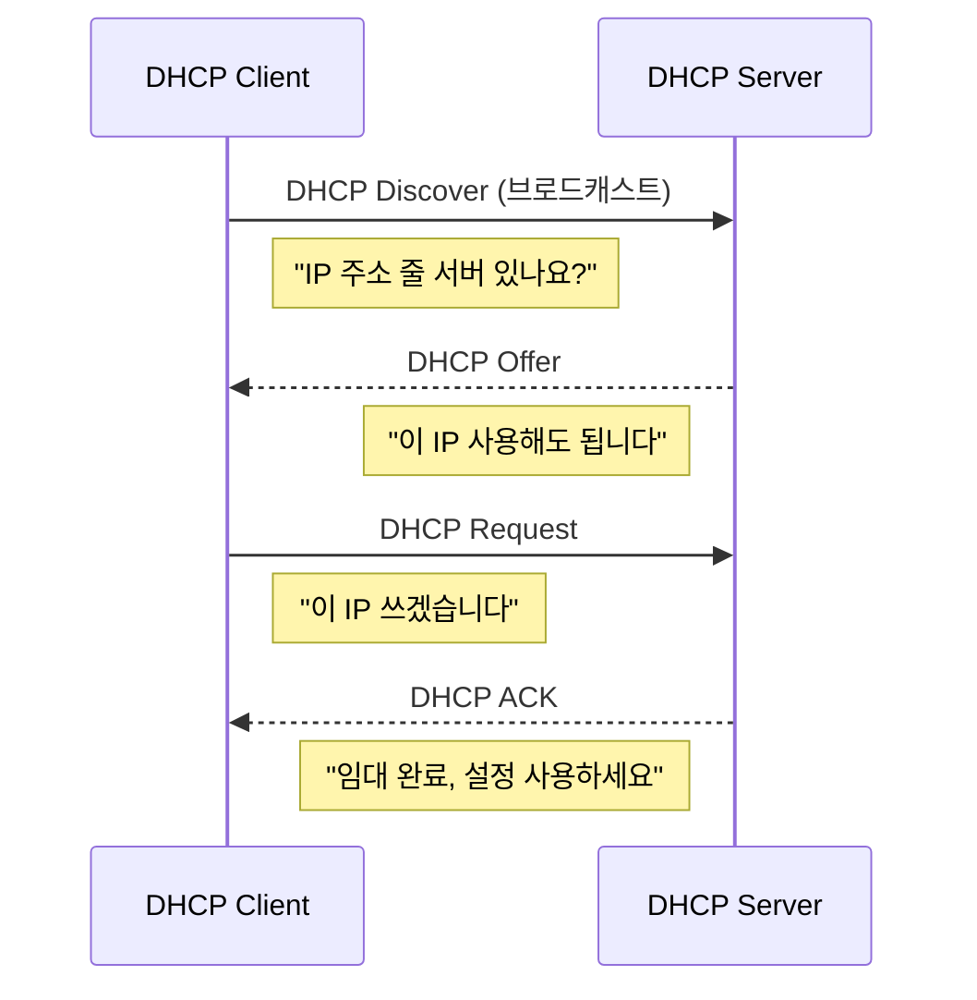

# IP 주소
IP 주소는 네트워크에서 각 장치를 식별하고 위치를 나타내기 위해 부여되는 논리적인 주소로, IP 프로토콜을 통해 패킷의 출발지와 목적지를 지정하는 데 사용됩니다.

## IPv4 와 IPv6

IPv4와 IPv6는 모두 네트워크 계층에서 동작하는 IP 프로토콜로 역할은 동일하지만, IPv6는 주소 공간 확장과 단순화된 설계를 통해 IPv4의 한계를 해결했습니다.

| **구분**  | **IPv4**              | **IPv6**               |
| ------- | --------------------- | ---------------------- |
| 주소 길이   | 32비트                  | 128비트                  |
| 주소 개수   | 약 43억 개               | 사실상 무한                 |
| 주소 표기   | 10진수, 점 표기192.168.0.1 | 16진수, 콜론 표기2001:db8::1 |
| 주소 고갈   | 발생 (이미 고갈)            | 발생하지 않음                |
| NAT 필요성 | 필수적으로 사용              | 불필요하도록 설계              |
| 주소 할당   | 수동, DHCP              | SLAAC, DHCPv6          |
| 브로드캐스트  | 사용함                   | 사용하지 않음 (멀티캐스트로 대체)    |
| 헤더 구조   | 가변 길이, 상대적으로 복잡       | 고정 길이, 단순화             |
| 체크섬     | 헤더 체크섬 존재             | 헤더 체크섬 제거              |
| 보안      | IPsec 선택 사항           | IPsec 기본 고려            |
| 이동성     | 별도 기술 필요              | 이동성 고려 설계              |
| 확장성     | 제한적                   | 매우 우수                  |

### NAT
NAT(Network Address Translation)**는 사설 IP 주소를 사용하는 내부 네트워크의 장치들이 **공인 IP 주소로 변환되어 인터넷과 통신할 수 있도록 해주는 기술**입니다.

주로 **IP 주소 고갈 문제를 해결**하고, 내부 네트워크 구조를 외부에 노출하지 않는 역할을 합니다.

#### NAT 단점
•	End-to-End 통신 원칙 위반
•	서버 운영 시 포트 포워딩 필요
•	일부 프로토콜(IPsec, P2P, VoIP)와 충돌
•	연결 상태를 NAT 장비가 관리해야 함

### DHCP
**DHCP(Dynamic Host Configuration Protocol)**는 네트워크에 접속한 장치에 IP 주소, 서브넷 마스크, 게이트웨이, DNS 정보 등을 자동으로 할당해주는 프로토콜입니다.
이를 통해 IP 주소를 수동으로 설정하지 않아도 네트워크 통신이 가능해집니다.

공유기(라우터에 내장), 전용 DHCP 서버, 방화벽, 클라우드 네트워크 장비 에서 **DHCP 서버**의 역할을 합니다
7계층 application layer에서 DHCP가 동작합니다

5️⃣ DHCP Relay가 등장하는 이유 (중요 ⭐️)

🔹 문제
	•	DHCP Discover는 브로드캐스트
	•	라우터는 브로드캐스트를 전달하지 않음

🔹 해결
	•	라우터가 DHCP Relay 역할 수행
	•	브로드캐스트 → 유니캐스트 변환
	•	다른 네트워크의 DHCP 서버와 통신 가능

### SLAAC

### DHCPv6

## 서브넷

## 서브넷 마스크

## 라우팅

## Public IP vs Private IP

## 라우팅 프로토콜

## IP 어떻게 할당하는지

## NAT이 뭔지

## ICMP에 대해

## 브라우저가 www.google.com을 입력했을떄 일어나는일

## 브라우저 -> 프론트엔드 처리까지 어떻게되는지

